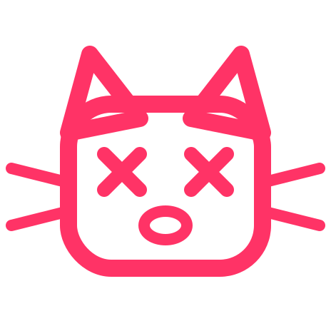

# CatastroSwitch

  

`CatastroSwitch` is a fork-first control repository for a custom VS Code product.

All runtime implementation belongs in a separate VS Code fork checkout, cloned from `https://github.com/hojurgen/vscode` into `C:\src\vscode-multiagent` with `https://github.com/microsoft/vscode` configured as `upstream`.

## Start here

### What this repo is for

- grounded fork docs
- executable phase plan
- workspace registry schema and example data
- phase execution state schema and sample data
- local agent session snapshot schema and sample data
- agent adapter contract
- fork bootstrap and maintenance scripts
- branding source asset for replacing stock VS Code icons during builds
- fork-consumable TypeScript and ESLint policy overlays
- GitHub Copilot instructions, agents, and skills

### Current implementation status

- `schemas/` contains the repo-owned contracts for workspace registry, phase state, and agent session snapshots.
- `examples/` contains concrete sample payloads for those contracts.
- `scripts/bootstrap-vscode-fork.ps1` clones or repairs the local `hojurgen/vscode` checkout and wires `upstream`.
- `scripts/generate-local-workspace.ps1` generates the machine-local maintenance workspace from the registry.
- `scripts/export-product-icons.ps1` treats `assets/logo.svg` as the authoritative product-branding source for build outputs.
- `.vscode/tasks.json` exposes the common bootstrap and maintenance actions inside VS Code.

### Repository layout

- `assets/logo.svg` is the canonical CatastroSwitch branding asset.
- `docs/` contains the control-repo architecture and the fork bootstrap runbook.
- `schemas/` contains JSON Schemas for repo-owned contracts.
- `examples/` contains sample JSON artifacts validated by those schemas.
- `scripts/` contains PowerShell helpers for fork bootstrap, workspace generation, branding export, and branch maintenance.

### Branding rule

Every CatastroSwitch runtime build replaces the stock VS Code product icons with artifacts derived from `assets/logo.svg`. The control repo owns the source asset and the export helper; the runtime fork consumes those generated assets during build and packaging.

### Quickstart

1. Run `Bootstrap local VS Code fork` from the VS Code tasks list, or execute `scripts/bootstrap-vscode-fork.ps1` directly.
2. Run `Generate local maintenance workspace` to rebuild `CatastroSwitch.local.code-workspace` from the registry sample.
3. Open the generated workspace and use the launch configurations to watch or self-host the fork.
4. Run `Export CatastroSwitch product icons` before wiring the branding hook into the fork build.

## Why the name

I picked `CatastroSwitch` because my daily work is basically speedrunning workspace hopping while talking to customers and babysitting agents in other workspaces at the same time, all so I can stumble into the next customer meeting looking prepared. Usually there is not even a one-minute gap between those contexts, because apparently context switching is now a competitive sport. One minute it is code review, then performance troubleshooting, then debugging, then some PoC in another language with another tool, then an architecture discussion, then removing go-live blockers on a process/business level because calm and continuity were clearly rejected during planning.

Also, I love cats. I have three of them. They occasionally help by walking across my keyboard or meowing into the camera during customer calls, because clearly professionalism improves when surprise feline QA gets involved.

My wife also loves me enough to throw sandwiches into the office when I am working overtime and apparently expects me to catch them like a dolphin being tossed food or toys at a marine park. This occasionally ends with lunch hitting me in the face because I was busy context switching and not paying attention. Love you, Babe. Apparently even lunch delivery in this house is event-driven and doubles as a live reflex test.

So yes: switching everywhere, small to medium catastrophes everywhere, cats, and airborne sandwiches. The name was not exactly hard to find.

YES! I mentioned agents. AND CATS. FOCUS ON THE CATS. AND THE AIRBORNE SANDWICHES. The code is AI-generated because apparently my job now is "writing software" but curating top-tier AI slop while three cats and a ballistic lunch-delivery system masquerade as quality control.
